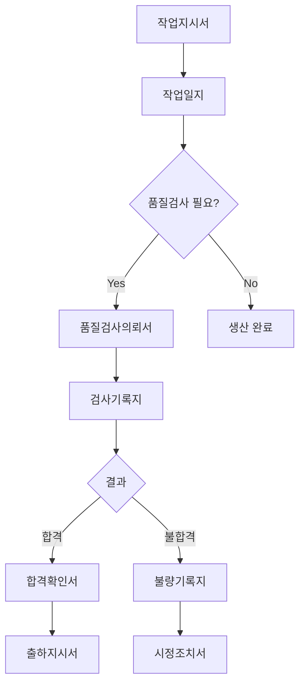

# 워크숍 산출물 관리

## 개요

Formology 워크숍의 산출물은 **시스템 개발의 핵심 기초 자료**입니다. 제대로 정리하고 활용하는 것이 프로젝트 성공의 열쇠입니다.

---

## 산출물 목록

### 1. FormType 목록 (FormType List)

**형태**: 포스트잇 + 그룹핑

**내용**:
```
[요청/의뢰] (노란색)
- 작업지시서 (FormType)
- 자재요청서 (FormType)
- 품질검사의뢰서 (FormType)
- 금형정비의뢰서 (FormType)

[기록] (파란색)
- 작업일지 (FormType)
- 검사기록지 (FormType)
- 정비일지 (FormType)
...

총 22개 FormType
```

**정리 방법**:
1. 포스트잇 사진 촬영 (고해상도)
2. Excel/Notion 테이블로 정리
3. 그룹별로 시트 분리

**Excel 템플릿**:
```
| 번호 | FormType명 | 그룹 | 접미어 | 빈도 | 중요도 | 우선순위 | 비고 |
|------|------------|------|--------|------|--------|----------|------|
| 1    | 작업지시서 | 요청 | 서 | 높음 | 높음 | 1순위 | |
| 2    | 작업일지 | 기록 | 지 | 높음 | 중간 | 1순위 | |
...
```

---

### 2. FormType 그룹 (FormType Groups)

**형태**: 그룹별 분류

**표준 그룹**:
```
1. 요청/의뢰 (Request)
   - 특징: 승인 필요, 공식 Document
   - 접미어: -서
   - FormType 예시: 작업지시서, 품질검사의뢰서

2. 기록 (Record Log)
   - 특징: 이력 관리, 실시간 작성
   - 접미어: -지
   - FormType 예시: 작업일지, 검사기록지

3. 보고/확인 (Report)
   - 특징: 결과 전달, 공식 Document
   - 접미어: -서, -록
   - FormType 예시: 검사보고서, 회의록

4. 표/현황 (Summary)
   - 특징: 집계, 통계
   - 접미어: -표
   - FormType 예시: 생산현황표, 재고집계표

5. 이력 (History)
   - 특징: 시계열, 검색
   - 접미어: -록
   - FormType 예시: 설비이력록, 불량이력록

6. 기준/표준 (Standard)
   - 특징: 버전 관리, 참조
   - 접미어: -서
   - FormType 예시: 작업표준서, 검사기준서
```

**정리 방법**:
```markdown
## FormType 그룹 정의

### 요청/의뢰
- 목적: 업무 시작 요청
- 특징: 승인 워크플로우 필요
- FormType: 작업지시서, 품질검사의뢰서, 자재요청서
- Document 시스템 요구사항:
  - 상태 관리 (임시저장, 제출, 승인, 거절)
  - 승인자 알림
  - 승인 이력

### 기록
- 목적: 업무 수행 내용 기록
- 특징: 변경 이력 추적
- FormType: 작업일지, 검사기록지, 정비일지
- Document 시스템 요구사항:
  - 이력 관리
  - 버전 관리
  - 감사 로그
```

---

### 3. 우선순위 매트릭스

**형태**: 2×2 매트릭스

```
        빈번함
          ↑
    표    │    록
  ┌───────┼───────┐
  │   4   │   1   │ ← 1순위 (MVP)
  │       │       │
──┼───────┼───────┼──→ 중요함
  │   3   │   2   │ ← 2순위
  │       │       │
  └───────┼───────┘
    메모  │   서
```

**정리 방법**:

**1순위 (MVP)** - 빈번 + 중요:
```
| FormType | Document 빈도 | 중요도 | 예상 개발 시간 |
|----------|---------------|--------|----------------|
| 작업지시서 | 일 10건 | 높음 | 3일 |
| 작업일지 | 일 10건 | 중간 | 2일 |
| 품질검사의뢰서 | 일 5건 | 높음 | 3일 |
| 검사기록지 | 일 5건 | 높음 | 2일 |
...

소계: 7개 FormType, 예상 2주
```

**2순위** - 중요하지만 덜 빈번:
```
| FormType | Document 빈도 | 중요도 | 개발 시점 |
|----------|---------------|--------|-----------|
| 작업표준서 | 월 2건 | 높음 | 2차 Sprint |
| 검사기준서 | 월 2건 | 높음 | 2차 Sprint |
...
```

---

### 4. Document 흐름도 (Workflow)

**형태**: 화살표로 연결된 Document 흐름

**개념**: FormType에서 파생된 Document 인스턴스 간의 흐름

**정리 방법**:

**텍스트 버전**:
```
[작업지시서 Document] 작성 ← FormType: 작업지시서
    ↓ (발행, Reference Section)
[작업일지 Document] 작성 (1:N, 일별) ← FormType: 작업일지
    ↓ (완료 시, Reference Section)
[품질검사의뢰서 Document] 생성 (선택) ← FormType: 품질검사의뢰서
    ↓ (검사 시작, Reference Section)
[검사기록지 Document] 작성 ← FormType: 검사기록지
    ↓
    분기: 합격? 불합격?
    ├─ 합격 → [합격확인서] → [출하지시서]
    └─ 불합격 → [불량기록지] → [시정조치서]
```

**Mermaid 다이어그램**:


---

### 5. Form 구조 스케치 (Form Structure Sketch)

**형태**: 손그림 또는 화이트보드 사진

**개념**: FormType → Form (Section/Field 구조)

**정리 방법**:

**작업지시서 FormType → Form 예시**:
```markdown
## FormType: "작업지시서" (Work Order)
## Form: 작업지시서 양식

### [Main Section] 헤더
- 지시번호: [자동채번] Field (예: WO20241105001)
- 작성일: [자동] Field
- 작성자: [로그인 사용자] Field
- 상태: Field 임시저장 / 제출 / 승인 / 거절

### [Main Section] 본문
- 제품명: [Selection Field ▼] ← Reference Section → products 테이블 FK
  * 제품 선택 시 자동으로 제품코드, 규격 표시
- 수량: [Numeric Field] 단위: EA
- 납기일: [Date Field]
- 사출기: [Selection Field ▼] ← Reference Section → machines 테이블 FK
  * 사출기 선택 시 현재 상태 표시 (가동중/정지/점검중)
- 금형: [Selection Field ▼] ← Reference Section → molds 테이블 FK
  * 금형 선택 시 최종 정비일 표시

### [Child Section] 자재 내역 (1:N)
- 원료: [Selection Field ▼] ← Reference Section → materials 테이블 FK
- 필요량: [Numeric Field]
- + 추가 버튼

### [Reference Section] 참조 문서
- 작업표준서: [참조 버튼] Field → 최신 버전만
- 검사기준서: [참조 버튼] Field → 최신 버전만

### 하단
- [임시저장] [제출] [취소] 버튼
```

**필드별 상세 정의**:
```
| 필드명 | 타입 | 필수 | 입력방식 | 제약조건 | 기본값 |
|--------|------|------|----------|----------|--------|
| 지시번호 | VARCHAR(20) | Y | 자동 | WO+날짜8자리+순번4자리 | 자동생성 |
| 제품명 | FK | Y | 선택 | products 테이블 | - |
| 수량 | INTEGER | Y | 입력 | > 0 | - |
| 납기일 | DATE | Y | 선택 | >= 작성일 | 작성일+7일 |
| 사출기 | FK | Y | 선택 | machines 테이블 | - |
...
```

---

### 6. Section → Entity 사상 규칙 적용 (ERD 초안)

**형태**: Section 기반 Record 구조

**개념**: Form의 Section 구조를 Entity로 변환

**정리 방법**:

```
## Section → Entity 사상

### Document Record 엔티티 (FormType → Record)
1. work_orders (FormType: 작업지시서 → Main Section)
2. work_logs (FormType: 작업일지 → Main Section)
3. qc_requests (FormType: 품질검사의뢰서 → Main Section)
4. inspection_records (FormType: 검사기록지 → Main Section)
...

### 마스터 엔티티 (Masters)
1. products (제품)
2. machines (설비)
3. molds (금형)
4. materials (자재)
5. defect_types (불량유형)
...

## Section 기반 관계 정의

### work_orders (Main Section) ↔ products (Master)
- Section 유형: Reference Section
- 관계: N:1 (작업지시서 Document 여러 개가 하나의 제품 참조)
- FK: work_orders.product_id → products.id
- 제약: ON DELETE RESTRICT (제품 삭제 시 참조 중이면 거부)

### work_orders (Main Section) → work_logs (Main Section)
- Section 유형: Reference Section (FK)
- 관계: 1:N (하나의 작업지시서에 여러 작업일지)
- FK: work_logs.work_order_id → work_orders.id
- 제약: ON DELETE CASCADE (작업지시서 삭제 시 작업일지도 삭제)

### work_logs → qc_requests (Reference Section)
- Section 유형: Reference Section
- 관계: 1:1 or 1:0 (작업일지 완료 시 선택적으로 검사의뢰)
- FK: qc_requests.work_log_id → work_logs.id
- 제약: ON DELETE RESTRICT
```

---

## 디지털화 프로세스

### 당일 (워크숍 종료 직후)

**1. 사진 촬영** (30분):
```
□ 화이트보드 전체 (2~3장)
□ 문서 목록 포스트잇 (클로즈업)
□ 그룹핑 결과
□ 우선순위 매트릭스
□ 문서 흐름도
□ 양식 스케치 (각 문서별로 1장씩)

※ 조명 확인, 흔들림 주의, 여러 장 촬영
```

**2. 포스트잇 보관**:
```
□ 포스트잇을 A4 용지에 옮겨 붙이기
□ 그룹별로 분리
□ 투명 파일에 보관
□ "워크숍 산출물 YYMMDD" 라벨 붙이기

※ 절대 버리지 말 것!
```

---

### 1일 후

**3. Excel 정리** (2시간):

**파일 구조**:
```
Formology_Workshop_YYMMDD.xlsx
├── [시트1] 문서 목록
├── [시트2] 문서 그룹
├── [시트3] 우선순위
├── [시트4] 문서 흐름
├── [시트5] 양식 정의
└── [시트6] ERD 초안
```

**템플릿 다운로드**: [링크](../07-reference/templates.md)

---

### 3일 후

**4. 문서화** (4시간):

**Markdown 문서 생성**:
```
docs/
├── 01_workshop_summary.md       (워크숍 개요)
├── 02_document_list.md           (문서 목록 상세)
├── 03_workflow.md                (문서 흐름도)
├── 04_form_specifications.md    (양식 명세)
└── 05_erd_draft.md               (ERD 초안)
```

---

### 1주 후

**5. 현업 검증** (1시간):

**검증 미팅**:
```
안건:
1. 정리된 문서 목록 확인
2. 양식 명세 검토
3. 빠진 부분 추가
4. 우선순위 재확인

방법:
- Excel 화면 공유
- 하나씩 읽어가며 확인
- 수정사항 즉시 반영

목표:
- 100% 합의
- "이거 맞아요!" 확인
```

---

## 활용 방법

### 개발팀 활용

**요구사항 명세서로 활용**:
```
1. 문서 목록 → 기능 목록
   - 작업지시서 → 작업지시 CRUD
   - 작업일지 → 작업일지 CRUD

2. 양식 스케치 → UI 목업
   - 필드 배치 그대로 적용
   - 입력 방식 정의 활용

3. 문서 흐름 → 워크플로우 엔진
   - 상태 전이 정의
   - 트리거 이벤트

4. ERD 초안 → 데이터베이스 설계
   - 테이블 생성
   - FK 관계 정의
```

**개발 일정 산정**:
```
문서 목록 × 평균 개발 시간
= 7개 MVP 문서 × 2일
= 14일 (2주)

+ 통합 및 테스트 1주
= 총 3주
```

---

### 현업 활용

**교육 자료로 활용**:
```
1. 신입 사원 교육
   - 문서 목록: "우리 회사에서는 이런 문서들을 씁니다"
   - 문서 흐름: "업무는 이렇게 진행됩니다"

2. 프로세스 개선
   - 현재 (As-Is): 워크숍 결과
   - 개선 (To-Be): 불필요한 문서 제거, 통합

3. 시스템 사용 설명서
   - "이 화면은 작업지시서입니다"
   - "워크숍 때 여러분이 그린 양식 그대로입니다"
```

---

## 버전 관리

### 변경 이력 추적

```markdown
## 문서 목록 변경 이력

### v1.0 (2024.11.05 - 워크숍)
- 초기 도출: 22개 문서
- 우선순위: 1순위 7개 선정

### v1.1 (2024.11.12 - 현업 검증)
- 추가: 재작업의뢰서, 출하확인서
- 삭제: 없음
- 수정: "일일생산일지" → "작업일지"
- 총 24개 문서

### v1.2 (2024.12.01 - 1차 개발 후)
- 추가: 가동률현황표 (현업 요청)
- 우선순위 변경: 월별생산현황표 1순위 → 2순위
- 총 25개 문서
```

---

## 보관 및 공유

### 파일 구조

```
project_root/
├── docs/
│   └── workshop/
│       ├── photos/
│       │   ├── whiteboard_1.jpg
│       │   ├── whiteboard_2.jpg
│       │   ├── postit_groups.jpg
│       │   └── form_sketches/
│       │       ├── work_order.jpg
│       │       └── work_log.jpg
│       ├── Formology_Workshop_20241105.xlsx
│       ├── 01_workshop_summary.md
│       ├── 02_document_list.md
│       ├── 03_workflow.md
│       ├── 04_form_specifications.md
│       └── 05_erd_draft.md
└── README.md
```

### 접근 권한

```
문서 목록, 워크플로우: 전체 공개
양식 명세, ERD: 개발팀 + 현업 관리자
워크숍 사진: 참석자만
```

---

## 성공 사례

### 제조 MES 프로젝트

**산출물 활용도**:
```
✅ 문서 목록 → 100% 기능 구현
✅ 양식 스케치 → 95% UI 반영 (5%는 UX 개선)
✅ 문서 흐름 → 워크플로우 엔진 구현
✅ ERD 초안 → 데이터베이스 설계 90% 완성

결과:
- 추가 요구사항 수집 불필요
- 개발 일정 예측 정확도 95%
- 현업 만족도 100%
```

---

## 체크리스트

### 워크숍 당일
```
□ 화이트보드 사진 촬영 (고해상도)
□ 양식 스케치 사진 (각 문서별)
□ 포스트잇 A4 용지에 이전
□ 투명 파일에 보관
□ 참석자 명단 기록
```

### 1일 후
```
□ Excel 정리 시작
□ 문서 목록 시트 작성
□ 그룹별 분류
□ 우선순위 매트릭스 입력
```

### 3일 후
```
□ Markdown 문서 생성
□ 양식 명세 상세화
□ ERD 다이어그램 작성
□ GitHub/Notion에 업로드
```

### 1주 후
```
□ 현업 검증 미팅
□ 수정사항 반영
□ 최종 버전 확정
□ 개발 착수
```

---

**관련 문서**:
- [워크숍 준비](preparation.md)
- [진행 가이드](facilitation-guide.md)
- [데이터베이스 설계](../05-realization/database-design.md)
